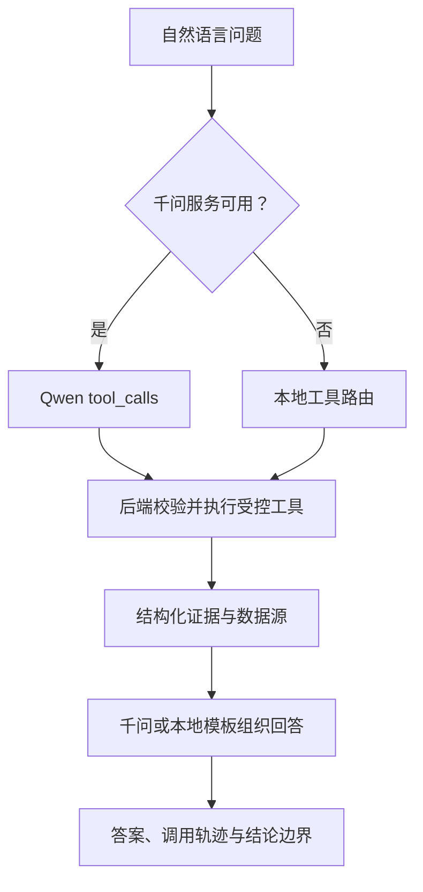

# 英超智析 Agent | Premier League Insight Agent

> 面向中文英超球迷与内容创作者的垂直足球数据分析助手  
> 将球队、球员与比赛数据转化为可查询、可比较、可解释的分析结论。

**当前版本：`v0.15.0 · Matchup Lab`**

**项目状态：MVP 开发中**

## 项目简介

Premier League Insight Agent 是一个结合足球数据工程、Web 开发与大模型应用的英超数据分析项目。

系统通过数据库查询、每 90 分钟指标计算、证据排序和结论边界判断生成结构化分析。League Copilot 允许通义千问从受控函数清单中选择数据工具；千问不可用时，系统会使用同一工具执行层的本地安全路由。

项目由数据科学与大数据技术专业学生独立开发，主要用于比赛展示、GitHub 项目积累与足球数据分析实践。

## 当前功能

| 模块 | 已实现能力 |
|---|---|
| 数据库 | 球队、球员、积分榜、比赛、事件与 Agent 分析记录关系模型 |
| 数据 API | 球队、积分榜、球员、历史比赛事件与分析记录查询接口 |
| 球场地图 | 2024-25 完整 20 队、球场搜索、标记联动与定位动画 |
| 球队详情 | 20 支球队均可从地图进入资料页，并展示该队完整球员赛季记录 |
| 完整积分榜 | 2024-25 最终 20 队积分榜、十列排序、冠军/欧冠/降级标记 |
| 赛季赛果管道 | OpenFootball 固定提交、CC0 许可、380 场解析校验与幂等导入 |
| Season Form Lab | 38 轮积分走势、20 队末五场、主客场拆分与球队 38 场赛果 |
| 球员数据中心 | 574 条球员—球队记录、搜索、筛选、排序、分页与详情页 |
| 球员可视化 | 后端统一计算每 90 分钟指标、位置感知百分位与单人/双人雷达图 |
| Similarity Scout | 同位置相似画像、位置权重、最大差异解释与一键双人对比 |
| Evidence Center | 统一核验数据来源、覆盖规模、许可、快照日期与使用边界 |
| Matchup Lab | 任意两队的赛季画像、八维优势矩阵与两回合直接交锋 |
| 球员分析 | 双球员比较、四种分析侧重点与 Player Lab 选择联动 |
| 比赛数据管道 | StatsBomb Open Data 清洗脚本、坐标归一化、来源 ID 与幂等导入 |
| Match Lab | Arsenal 4–2 Liverpool 的 28 次射门、xG 对比、筛选、进球时间线与事件清单 |
| Agent 工具链 | 意图识别、数据查询、指标计算、证据排序与结论生成 |
| League Copilot | 积分榜、球队状态、球队对阵、球员比较、相似画像、单场射门六工具调度 |
| 函数调用 | 千问 OpenAI-compatible `tool_calls`、后端参数校验与可视化执行轨迹 |
| Agent Notebook | 自动保存分析、最近记录、历史恢复、父子追问链与上下文轨迹 |
| 球探报告 | 独立报告页、指标表、证据链、来源边界及打印 / 保存 PDF |
| 千问增强 | 接入 `qwen-plus`，生成更自然的中文足球分析 |
| 安全降级 | 千问不可用时自动进入 `LOCAL SAFE MODE` |
| 前端交互 | 分析任务入口、加载状态、错误提示与重新尝试 |
| 工程能力 | 数据库迁移、统一响应结构、自动化测试与环境变量管理 |

当前数据库包含 **20 支球队、20 条最终积分榜记录、574 条球员—球队赛季记录（562 个姓名）、380 场 2024-25 完整赛果、1 场公开历史事件比赛和 28 次射门事件**，并保存本机生成的 Agent 分析快照。积分榜、赛果和球员数据使用 2024-25 口径；比赛事件是 2003/2004 独立历史快照，两个赛季不会合并计算。

## Agent 工作流程



千问可以选择允许的工具，但不能直接访问数据库。工具名称、参数、赛季和实体均由后端校验；排名、积分、比分、xG 和球员指标仍由本地代码计算。

## 技术栈

| 层级 | 技术 |
|---|---|
| 前端 | Next.js、React、TypeScript、Tailwind CSS、React Leaflet |
| 地图 | Leaflet、OpenStreetMap 标准瓦片 |
| 后端 | Python、FastAPI、Pydantic |
| 数据层 | SQLite、SQLAlchemy、Alembic |
| 公开事件数据 | StatsBomb Open Data |
| 完整赛果数据 | OpenFootball English Results（CC0） |
| 球员赛季数据 | Kaggle Top 5 League Football Player Stats v1（CC0） |
| AI 能力 | 通义千问 OpenAI-compatible API、`qwen-plus` |
| 测试与质量 | Pytest、ESLint、Next.js Build |
| 版本管理 | Git、GitHub |

## 本地运行

### 1. 克隆项目

```powershell
git clone https://github.com/ruiyangxie434-byte/premier-league-insight-agent.git
cd premier-league-insight-agent
```

### 2. 启动后端

```powershell
cd backend
python -m venv .venv
.\.venv\Scripts\Activate.ps1
python -m pip install -r requirements.txt
Copy-Item .env.example .env
python -m uvicorn app.main:app
```

后端启动成功后访问：

- API 地址：`http://127.0.0.1:8000`
- API 文档：`http://127.0.0.1:8000/docs`

### 3. 启动前端

新建一个终端，在项目根目录运行：

```powershell
cd frontend
npm install
npm run dev
```

浏览器访问：

```text
http://localhost:3000
```

## 地图配置

地图默认使用 OpenStreetMap 标准瓦片，并在地图内显示数据署名。需要切换合规的地图瓦片服务时，可在 `frontend/.env` 中设置：

```dotenv
NEXT_PUBLIC_MAP_TILE_URL=https://tile.openstreetmap.org/{z}/{x}/{y}.png
```

球队与球场坐标始终来自后端 `/api/clubs`，前端地图没有重复硬编码业务坐标。地图侧栏支持按球队、城市或球场搜索。

## 球员数据中心

访问 `http://localhost:3000/players` 可以：

- 搜索球员、球队或国籍；
- 按球队、位置与最低出场分钟筛选，并在 50 条一页的结果中翻页；
- 按累计数据或每 90 分钟指标排序；
- 选择两名球员生成位置感知百分位雷达；
- 进入球员详情，查看累计数据、每90指标和百分位条；
- 在球员详情按 450 / 1800 / 2700 分钟门槛寻找同位置相似球员；
- 查看相似分、最接近指标和最大画像差异，并一键恢复双人雷达；
- 把所选两名球员直接带入现有 Agent 继续分析。

球员快照覆盖 2024-25 英超 20 队，共 574 条球员—球队记录；默认 450 分钟门槛下有 400 条合格记录。雷达图优先使用同位置合格记录；同位置少于 3 条时回退到全部合格记录，并显示真实比较数量。详细来源、公式和边界见 [`docs/PLAYER_LAB.md`](docs/PLAYER_LAB.md)。

Similarity Scout 使用七项每90指标的同位置百分位差异，并根据前锋、中场、后卫分别设置可见权重。它排除目标球员的其他转会分段；由于当前快照缺少扑救、失球与零封字段，门将页面会明确停用推荐，而不是输出误导性相似分。算法、权重与 API 见 [`docs/SIMILARITY_SCOUT.md`](docs/SIMILARITY_SCOUT.md)。

## 比赛实验室

访问 `http://localhost:3000/matches` 可以：

- 打开 Arsenal 4–2 Liverpool（2004-04-09）公开历史事件快照；
- 对比双方射门、总 xG、实际进球与 `Goals - xG`；
- 按球队或进球结果筛选 28 次射门；
- 在进攻半场图上按 xG 大小查看射门位置；
- 点击射门查看球员、时间、结果、身体部位和进攻方式；
- 通过 6 个进球重建比赛时间线；
- 直接查看原始事件 JSON、开放数据许可和解释边界。

原始坐标从 StatsBomb `120 × 80` 归一化至 `0–100`。清洗脚本、公式、API 与赛季边界见 [`docs/MATCH_LAB.md`](docs/MATCH_LAB.md)。

## 赛季状态实验室

访问 `http://localhost:3000/form` 可以：

- 查看 2024-25 英超 380 场最终比分汇总与 1115 个进球；
- 选择两支球队对比第 1–38 轮累计积分走势；
- 查看 20 队最终排名、整体 / 主场 / 客场记录与末五场状态；
- 从状态表进入任意球队页，查看 38 场赛果、最长不败和最近五场；
- 核对固定数据提交、CC0 许可和历史快照边界。

赛果来自 OpenFootball 固定提交，运行时不联网更新。延期比赛在积分曲线中归回原轮次，末五场按真实开球日期排序。清洗校验、公式、API 和边界见 [`docs/SEASON_FORM_LAB.md`](docs/SEASON_FORM_LAB.md)。

## Agent Notebook 与球探报告

首页 Agent 工作台会自动保存每次完成的分析。用户可以：

- 在最近记录中重新打开任意分析；
- 继承同一组球员与赛季继续追问，并按新问题重新计算指标；
- 查看父记录、追问深度和 `run_memory` 工具轨迹；
- 打开 `/reports/{run_id}` 查看独立球探报告；
- 通过浏览器打印功能保存为 PDF，报告保留指标、证据、来源和结论边界。

记录目前只保存在项目连接的 SQLite 数据库中，不包含登录、云同步或跨用户共享。接口、数据模型和边界见 [`docs/AGENT_NOTEBOOK.md`](docs/AGENT_NOTEBOOK.md)。

## League Copilot

访问 `http://localhost:3000/copilot` 可以：

- 用自然语言查询 2024-25 最终积分榜；
- 调用球队对阵工具完成八维历史比较与两回合直接交锋；
- 复用既有球员每90指标与证据排序工具；
- 查询一名外场球员的同位置相似画像，并解释接近项和主要差异；
- 调用 2003-04 历史比赛射门与 xG 工具，并保持赛季隔离；
- 查看模型或本地路由选择的函数、规范化参数、调用顺序和数据源；
- 在没有千问 Key 时使用同一组真实工具完成可复现演示。

工具注册、Qwen `tool_calls`、API、降级与边界见 [`docs/LEAGUE_COPILOT.md`](docs/LEAGUE_COPILOT.md)。

## 千问配置

项目未配置千问 API Key 时仍可运行，并自动使用本地安全分析模式。

如需启用千问增强：

1. 复制 `backend/.env.example` 为 `backend/.env`。
2. 按照示例文件填写自己的千问 API Key。
3. 不要将 `.env` 或真实 API Key 上传到 GitHub。

分析结果页面会显示当前模式：

- `QWEN ENHANCED`：千问调用成功。
- `LOCAL SAFE MODE`：正在使用本地分析结果。
- `QWEN TOOL CALLING`：League Copilot 由千问选择受控函数。
- `LOCAL TOOL ROUTER`：League Copilot 由本地路由选择相同函数。

## 项目测试

后端测试：

```powershell
cd backend
python -m pytest
```

前端检查：

```powershell
cd frontend
npm run lint
npm run build
```

`v0.15.0` 在 v0.14.0 全部能力上新增 Matchup Lab，阶段验收项目：

- 后端：55/55 测试通过，覆盖相似度排序、Copilot 相似检索、门将边界、转会分段排除、全量球员快照、迁移、Agent 与范围门控
- 前端：Lint 通过
- 前端：TypeScript 通过
- 前端：Production Build 通过
- `localhost:3000` 与 `127.0.0.1:3000` 均可连接开发后端，旧单一来源 `.env` 自动兼容
- 相似球员可从详情页一键带入双人雷达，球员搜索使用 250 ms 防抖且筛选时保留当前结果
- Alembic 可从空库顺序升级至 `20260811_0004`，旧数据无需删除
- v0.11.0 数据库可无损补入 574 条球员记录，并保留既有球员 ID、完整生日与球衣号码
- 首页、League Copilot、赛季状态、报告页、比赛中心、比赛详情、球员中心、球队详情与球员详情路由构建通过

## 版本进度

- [x] `v0.1.0` 前后端项目骨架与健康检查
- [x] `v0.2.0` SQLite 数据层、关系模型与基础 API
- [x] `v0.3.0` 双球员分析 Agent MVP
- [x] `v0.4.0` 通义千问增强与本地安全降级
- [x] `v0.5.0` 英格兰交互地图与球队球场探索
- [x] `v0.6.0` 完整 20 队、可排序最终积分榜与数据来源说明
- [x] `v0.7.0` Player Lab、球员详情、每90数据榜与双人雷达图
- [x] `v0.8.0` 公开比赛数据管道、射门图、xG 对比与进球时间线
- [x] `v0.9.0` Agent 分析记录、上下文追问与可打印球探报告
- [x] `v0.10.0` 380 场完整赛果、赛季状态、积分走势与球队近期结果
- [x] `v0.11.0` 千问真实函数调用、四类受控工具、执行轨迹与本地工具路由
- [x] `v0.12.0` 2024-25 全联赛球员快照、分页、位置百分位与转会记录消歧
- [x] `v0.13.0` 同位置相似球员、位置权重、画像差异解释与本地连接可靠性
- [x] `v0.14.0` 统一数据证据 API、来源目录、覆盖统计与限制说明页面
- [x] `v0.15.0` 两队对阵 API、八维历史比较、直接交锋与非预测边界
- [ ] 多赛季历史分析
- [ ] 在线部署与移动端优化

## 数据说明

当前版本的球队范围、2024-25 最终积分榜、380 场赛果和 574 条球员—球队记录均为历史快照。球员快照覆盖 562 个姓名；12 条跨队附加记录按俱乐部分别保留。Match Lab 单独使用 StatsBomb Open Data 的 2003/2004 历史比赛事件。

积分榜、赛果和比赛 API 都返回来源、许可与时间边界。Copilot 只调度这些已有数据工具，不把模型表述当作新数据来源；球探报告保存的也是已计算结果快照。球场坐标遵循 OpenStreetMap 署名要求，比赛页保留 StatsBomb 署名。数据边界见 [`docs/DATA_SOURCES.md`](docs/DATA_SOURCES.md)，函数调用见 [`docs/LEAGUE_COPILOT.md`](docs/LEAGUE_COPILOT.md)，赛果与状态见 [`docs/SEASON_FORM_LAB.md`](docs/SEASON_FORM_LAB.md)，球队对阵见 [`docs/MATCHUP_LAB.md`](docs/MATCHUP_LAB.md)，球员指标见 [`docs/PLAYER_LAB.md`](docs/PLAYER_LAB.md)，相似度方法见 [`docs/SIMILARITY_SCOUT.md`](docs/SIMILARITY_SCOUT.md)，比赛清洗和解释边界见 [`docs/MATCH_LAB.md`](docs/MATCH_LAB.md)。

## 当前边界

当前 MVP 暂不包含：

- 用户注册与登录
- 新闻资讯
- 实时比分推送
- 比赛结果预测
- 多赛季历史与实时赛程
- 实时阵容、转会和伤病更新
- 无依据的自由问答

项目当前重点是完成一条可靠的流程：

```text
自然语言问题 → 受控工具规划 → 后端查询 / 计算 → 可验证证据 → 结论边界 → 千问或本地解释
```

## 项目定位

本项目不仅是一个英超信息展示网站，更是一项覆盖以下能力的综合实践：

- 足球数据建模与数据库设计
- 后端 API 开发
- 数据清洗与衍生指标计算
- Agent 工具链设计
- 大模型安全接入
- 前后端交互与工程测试

---

如果你对项目有建议，欢迎提交 Issue。

**Premier League Insight Agent is under active development.**
